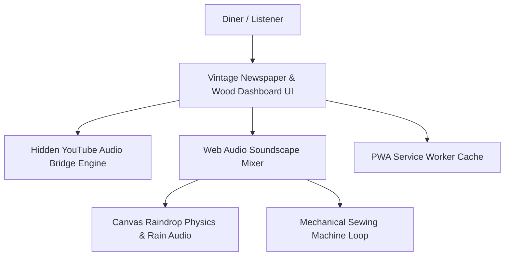

# 📻 Royal Tailor (रॉयल टेलर — Est. 1967) | Nostalgic Indian Tailor Shop Ambient Radio

[](https://royaltailor.vercel.app/)
[](https://developer.mozilla.org/)
[]()

> **Royal Tailor** is an evocative, nostalgic retro ambient web experience that transports you into a classic 1970s Indian neighbourhood tailor shop. Listen to curated vintage Bollywood classics blended with soothing rain sounds and the rhythmic clatter of an antique Usha sewing machine.

---

## ✂️ Features

- **📻 Vintage Bollywood Radio**: Stream timeless Hindi golden era tracks across genres (Nostalgic Oldies, Corporate Majdoor, Rainy Afternoon, Raju Mistri, Gen Z Retro).
- **🎛️ Dual-Layer Ambient Soundscape**: Independently control the volume of the ambient rain simulator and authentic sewing machine mechanical sounds.
- **🌧️ Dynamic Raindrop Physics**: Canvas-based raindrop and window condensation effects reacting to volume changes.
- **📱 PWA & Offline Support**: Progressive Web App with registered Service Worker (`sw.js`) for seamless mobile playback.
- **🔍 SEO & Schema.org Optimized**: Full JSON-LD structured data for Google Search indexing and Open Graph social sharing cards.

---

## 🏗️ Architecture



---

## 🛠️ Tech Stack

- **Frontend**: Semantic HTML5, Vanilla CSS3 (Custom Wood & Paper Texture Aesthetics), Vanilla ES6+ JavaScript
- **Audio Engine**: YouTube IFrame Player API & HTML5 Audio Layering
- **Fonts**: Rozha One, Special Elite, Space Grotesk (via Google Fonts)
- **Deployment**: Vercel Edge Hosting

---

## 🚀 Running Locally

```bash
# Clone the repository
git clone https://github.com/Harshxu/RoyalTailor.git
cd RoyalTailor

# Start any local HTTP server
python -m http.server 8000
```
Open `http://localhost:8000` in your web browser.
